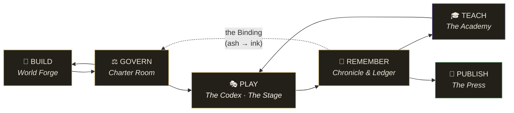
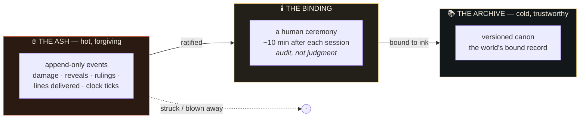
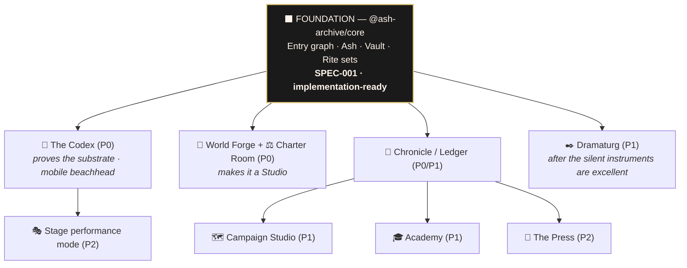
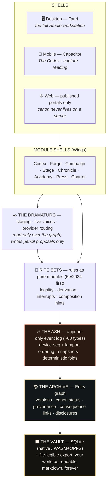

<div align="center">

<br/>

# ⬛ ASH & ARCHIVE
### · *the* STUDIO ·

**The operating system for fictional worlds.**

*Where a world is built, governed, played, remembered, taught — and published.*

<br/>


<br/>

**Ash** — the forge: fire, creation, the live session burning in real time.
**Archive** — the canon: the bound record, the world's memory, what survives the fire.

*The name is the architecture.*

<br/>

</div>

---

## Why this exists

Every tool in this space owns **one verb**. World Anvil *stores*. Foundry *plays*. Sudowrite *drafts*. Obsidian *links*. Nobody owns **the loop** — and the loop is where all the value leaks: game masters lose hours re-consolidating what changed at the table back into their lore; authors lose 10–30% of their creation time to continuity repair; AI tools hallucinate against canon because no tool *has* enforceable canon; publishing a living world means manual curation across four disconnected products.

**Ash & Archive Studio owns the loop:**



It can own the loop because the substrate was designed for it from the first line — not retrofitted onto a wiki or a VTT.

> **The true product is not software. It is transformation:**
> *Beginner → Competent → Confident → Expressive → Immersive → Master Storyteller.*
> Every feature exists to move one person along that ladder — with evidence.

---

## The mental model (three ideas, everything else follows)

### 1 · The Entry — documents are replaced by facts

The atomic unit is not a page or a sheet. It is the **Entry**: a typed, versioned record of one thing that is true (or *deliberately unknown*) in a world — a person, a place, a secret, a pressure clock, a spell, a persona, a session, a training rep, a ruling. Eleven kinds. Every Entry carries three fields no other product has as architecture:

| Field | Values | What it means |
|---|---|---|
| **Canon status** | `LOCKED` · `PROVISIONAL` · `UNKNOWN` | What you can lean on. UNKNOWN is a *feature* — a named, bounded mystery with a discovery payoff attached |
| **Provenance** | `ink` · `pencil` · `ash` | **Humans write in ink. AI writes in pencil. Play writes in ash.** Nothing changes provenance except a human act |
| **Consequence links** | `threatens` `serves` `hides` `unlocks` `escalates-to` `witnessed-by` `contradicts` | Relationships are primary — a hyperlink says *related*; a consequence link says *why it matters* |

### 2 · Ash → the Binding → Archive — two temperatures of truth



Live play needs *speed and forgiveness*: log everything, judge nothing, never block. Canon needs *deliberation and trust*: admit slowly, version everything, never drift. One store cannot have both physics — so there are two, joined by a ceremony. This single mechanism solves **undo**, **the session journal**, **canon governance**, **AI provenance**, and **table→lore persistence** (improvise a faction at the table; it's a governed Entry by morning — the market gap every VTT and wiki leaves open).

**Nothing becomes canon except by human hands. There is no auto-bind. Anywhere. Ever.**

### 3 · Time replaces navigation — the three Stances

No tab bars. No mode toggles. The Studio is organized the way the craft is: **before, during, after.**

| Stance | Physics | What lives there |
|---|---|---|
| 🕯️ **The Desk** *(before)* | deep · slow · branching | Worldbuilding, character forging, session prep, canon governance |
| ⚔️ **The Table** *(during)* | ≤80ms · ≤2 gestures · composed | The self-turning book — live play with zero navigation tax |
| 📖 **The Ledger** *(after)* | deliberate · ceremonial | The Binding, the chronicle, the growth record |

The interaction grammar is **six verbs**, closed and frozen: **Turn · Unfold · Inscribe · Strike · Kindle · Bind**. A user who knows the grammar can predict how a feature they've never seen will work — that prediction *is* the feeling of inevitability.

---

## The nine rooms — module atlas

The Studio is a modular ecosystem. Every module (**a "Wing"**) signs one contract — same Entry graph, same design language, same grammar, same AI constitution — and each is a *room*, not a silo.

| # | Module | Purpose | AI role | Priority | Status |
|---|---|---|---|---|---|
| 1 | 📕 **The Codex** | The flagship: Player Academy + table instrument — character forging, the self-turning Table, Masks, the Binding | Co-DM voice in the margin | **P0** | 📜 **Spec complete (GENESIS v2.0)** |
| 2 | 🔨 **World Forge** | Worldbuilding as engineering: Gravity Truths, Power Lattice, Toys, Pressure Clocks, Portable Truths, the **Readiness Gate** — worlds measured by *readiness to generate play*, not article count | Builder drafts in pencil | **P0** | 📜 Spec complete (Studio GENESIS) |
| 3 | ⚖️ **Charter Room** | Canon governance — the moat: LOCKED/PROVISIONAL/UNKNOWN, the Contradiction Bench, alias protocol | Archivist detects drift | **P0** | 📜 Spec complete |
| 4 | 🗺️ **Campaign Studio** | The arc above the session: story spines, plot threads, timelines, chronicle-aware prep | Ideator sharpens arcs | P1 | 📜 Spec complete |
| 5 | 🎭 **The Stage** | The DM's live table + (later) streamer performance mode with revenue plumbing | Co-DM consequence options | P0 / P2 | 📜 Spec complete |
| 6 | 📖 **Chronicle & Ledger** | The world's record: every session a bound, readable chapter; growth as evidence | Archivist drafts the Reading | P0/P1 | 📜 Spec complete |
| 7 | 🎓 **The Academy** | A prescription engine that *reads your actual play* and trains what your last session proves you need | Coach observes, never judges | P1 | 📜 Spec complete |
| 8 | ✒️ **The Dramaturg** | The studio's AI — five voices, one constitution, zero chat windows | *is* the AI | P1 | 📜 Constitution complete |
| 9 | 📜 **The Press** | Worlds leave as artifacts: chronicles → books, subscriber lore portals, drip-feeds, print | Composition assistance | P2 | 📜 Spec complete |

<details>
<summary><b>The dependency spine (build-order truth)</b></summary>


</details>

---

## Spotlight: The Codex

The flagship module, specified to council-hardened depth in [`products/the-codex/GENESIS/`](products/the-codex/GENESIS/) — twelve chapters that survived a five-seat adversarial design review (~120 findings integrated).

> *The Codex is not an app that contains a book metaphor. **The Codex is a book that is being written by play.***

- **The self-turning book** — game state drives navigation, but *the book earns the wheel*: autonomy is offered, consented to per event-type, and revocable with one gesture. A bookmark **ribbon** keeps your place when the book turns itself.
- **Four folios**, composed live: *the* VITALS (HP at 72px, the page grows worried as health falls) · *the* ACTION (a dealt hand of what's legal *now* — never a spell list) · *the* STAGE (initiative, Cohorts for hordes, statblocks one tap away) · *the* RESOURCES. Real 5e truth: a **reaction ribbon** for interrupts, auto-prompted concentration saves, readied actions as armed cards.
- **The DM's spread is the craft loop made furniture**: FRAME → OFFER → ASK → RESOLVE → REVEAL → RECORD — a first-session DM running from this spread is structurally running a master's procedure.
- **The Binding** — ten minutes, five movements, reward-first; or **Bank the fire**, the honest 2-minute variant for 11pm. **The Table Covenant** and **the Veil** make safety furniture, not settings.
- **The Last Page** — when a character dies, the book holds space. Grief is honored, not logged.

---

## The design language — *the Ledger System*

> *A 14th-century scriptorium designed a Formula-1 cockpit; then a senior product designer made sure every interaction responded in 80 milliseconds.*

Three materials only — **obsidian** (the ground), **the page** (typographic discipline, not parchment JPEGs), **ink** (where all meaning lives). Forbidden forever: glassmorphism, neon, bright SaaS, skeuomorphic textures.

| Register | Token | Value | Law |
|---|---|---|---|
| Ground | `--canvas` | `#1a1a1a` | warm near-black, never blue |
| Reading | `--ink-body` | `#9c8e7d` | **body text is warm grey, never white** |
| Emphasis | `--ink-emphasis` | `#fff5eb` | reserved: HP numerals, display moments |
| Actionable | `--gold` | `#c9a862` | **gold means exactly one thing: you can act on this, now** — capped at ~10–15% of any screen |
| AI | `--pencil` | `#a29f93` | the only cool tone in the product — AI proposals read as *foreign* until a human inks them |
| Healing | `--heal` | `#5a9a6a` | semantic color never travels alone (always paired with weight/shape/glyph) |
| Danger | `--wound` | `#b84a2a` | burnt sienna, never pure red |

**Type:** Crimson Pro (display serif) · IBM Plex Sans (mechanics) · IBM Plex Mono (*every* number is an instrument reading). **Motion:** four registers — 120ms micro · 280ms state · 520ms transition · **880ms ceremony**, reserved for fewer than ten consequential moments in the whole product. **Rubrication:** when a condition changes the rules of reality, it doesn't add a badge — *it rewrites the affected text in condition-colored ink*, bleeding in from the margin like ink in water. **The Named-Choice Doctrine:** every visual choice must be nameable; "it's the default" is a failing answer.

Ships as versioned tokens (`@ash-archive/ledger-tokens`) that every module consumes — the design language *is* a dependency, not a mood board.

---

## The AI constitution — *the Dramaturg*

The AI is infrastructure, and it is **governed**. One Dramaturg, five voices, no chat window anywhere:

| Voice | Where | Register |
|---|---|---|
| **The Ideator** | Desk | 2–4 tight options with fallout; calls out clichés |
| **The Builder** | Desk | drafts Entries *inside the forms*, in pencil |
| **The Archivist** | Ledger · Charter | groups ash into scenes; detects contradictions, with citations |
| **The Coach** | Academy | observation + offer, never verdicts |
| **The Co-DM** | Table | ≤140 chars, ≤2 margin notes, silence honored |

Constitutional law, enforced in the event layer — not by prompt:

- **No silent invention** — it never states a world-fact that isn't a bound Entry; missing canon is named `UNKNOWN`
- **Pencil, always** — every output is provenance-marked; the AI *has no Bind verb*, structurally
- **No authoring outcomes** — it proposes options with consequences; it never decides what happens
- **The Readiness Gate binds it** — asked to scaffold a campaign on an unready world, it refuses and shows the smallest next build
- **Graceful absence** — no model configured? The Studio is *fully functional minus pencil*. Every AI feature is an overlay on a complete manual instrument.

---

## Architecture



**Local-first, offline-complete.** There is no server in the core: canon computation is client-side; an account exists only for sync, hosted portals, and licensing. **The ownership covenant:** at any moment, your world exports as a folder of human-readable markdown + JSONL — Obsidian-openable, losslessly re-importable, byte-faithful including attachments. *Your world must survive this product's death.*

The Foundation (`@ash-archive/core`) is specified to implementation grade in [`studio/SPECS/SPEC-001-FOUNDATION.md`](studio/SPECS/SPEC-001-FOUNDATION.md): the full event vocabulary with payload schemas, the Binding as a three-phase idempotent transaction, authoritative SQL DDL, the typed Wing API, eight named invariants, an error taxonomy, CI-enforced performance budgets (80ms folio paint · ≤2s cold resume · <100ms search at 100k entries), and an eight-family testing strategy.

---

## Repository map

```
/                                   ← Ash & Archive: The Studio (this repo)
│
├── canon/                          ⚖️  ECOSYSTEM LAW
│   └── ASH-AND-ARCHIVE-CANON.md        the constitution every module inherits
│
├── studio/                         🏛️  THE STUDIO ITSELF
│   ├── STUDIO-GENESIS/                 master spec v1.0 — vision & market ·
│   │                                   the nine modules · architecture, UX & roadmap
│   └── SPECS/
│       └── SPEC-001-FOUNDATION.md      @ash-archive/core — implementation-ready · BUILD HERE FIRST
│
├── products/
│   └── the-codex/
│       └── GENESIS/                📕  the flagship's canon — 12 chapters, v2.0,
│                                       council-hardened (+ the council record in _council/)
│
├── src/                            🌐  the landing page + the Director's Sanctum
│                                       dashboard prototype (mock data; legacy tokens —
│                                       the Ledger System supersedes its visual language)
└── index.html · vite.config.ts …      Vite app scaffolding for the web presence
```

**Reading paths:**

| You are… | Read in this order |
|---|---|
| 🧭 *Anyone* | This README → [`canon/ASH-AND-ARCHIVE-CANON.md`](canon/ASH-AND-ARCHIVE-CANON.md) |
| 🎨 *Designer* | Codex GENESIS [`03-DESIGN-LANGUAGE`](products/the-codex/GENESIS/03-DESIGN-LANGUAGE.md) → [`04-THE-TABLE`](products/the-codex/GENESIS/04-THE-TABLE.md) → [`11-AAA-ENHANCEMENT`](products/the-codex/GENESIS/11-AAA-ENHANCEMENT.md) |
| 🧠 *Product* | Studio GENESIS [`01-VISION-AND-MARKET`](studio/STUDIO-GENESIS/01-VISION-AND-MARKET.md) → [`02-THE-MODULES`](studio/STUDIO-GENESIS/02-THE-MODULES.md) |
| 🔧 *Engineer* | [`SPEC-001-FOUNDATION`](studio/SPECS/SPEC-001-FOUNDATION.md) → Codex GENESIS [`08-ARCHITECTURE`](products/the-codex/GENESIS/08-ARCHITECTURE.md) → [`10-ROADMAP`](products/the-codex/GENESIS/10-ROADMAP.md) |

---

## Implementation status — honest register

| Layer | Status |
|---|---|
| Ecosystem constitution | ✅ **Bound** (`canon/`) |
| Studio master specification | ✅ **Bound v1.0** — vision, market case, nine modules, architecture, roadmap |
| The Codex product canon | ✅ **Bound v2.0** — 12 chapters, five-seat adversarial council pass |
| Foundation engineering spec | ✅ **SPEC-001 implementation-ready** — a team can build without redesign |
| Landing page (this repo's app) | ✅ Built — 11 sections, production-ready |
| Director's Sanctum dashboard | 🟡 Prototype — complete UI on mock data; interaction patterns feed the Studio shell |
| `@ash-archive/core` | ⬜ **Next** — Phase 0.5 proving spikes (Tauri + SQLite performance), then SPEC-001 §19 build order |
| Everything above the Foundation | ⬜ Gated — each phase independently shippable, each gate measurable |

**The roadmap in one line each:** **MVP** = the Codex + the World Forge floor inside the Tauri shell — one stranger closes the whole loop once (build → PASS → prep → play → bind). **v1.0** = the professional loop: Campaign Studio, the Dramaturg, the Academy, multi-device sync, paid tiers. **v2.0** = the creator platform: the Press, the Stage's performance mode, multiplayer authoring.

---

## Principles (what this refuses to be)

- ❌ **Not a virtual tabletop** — it's the instrument in one person's hand *at* a table
- ❌ **Not a content marketplace** — no feeds, no engagement loops, no streaks; retention comes from growth and a world that remembers, or it isn't deserved
- ❌ **Not a note-taking app with a fantasy skin** — Entries are typed, status-bearing, consequence-linked facts
- ❌ **Not a DM-replacement** — the AI is constitutionally forbidden from authoring outcomes
- ❌ **Not dark-fantasy wallpaper** — the register is scholarly, quiet, warm-dark, precise

> **Sibling, not sub-project:** *Sipur* — the AI filmmaking OS — is a separate operating system with its own repository and constitution. Neither inherits the other; future interop is via clean APIs only.

---

<details>
<summary><b>🛠️ Running the web presence locally (the landing page + dashboard prototype)</b></summary>

<br/>

```bash
git clone https://github.com/DOSENFT/ash-and-archive-studio.git
cd ash-and-archive-studio
npm install
npm run dev        # → http://localhost:5173  (landing page; /dashboard for the Sanctum prototype)
```

`npm run build` · `npm run preview` · `npm run lint`. Stack: React 18 + TypeScript + Vite + Tailwind. Note: this app is the *web presence*, not the Studio — the Studio proper begins at SPEC-001.

</details>

<details>
<summary><b>🤝 Contributing</b></summary>

<br/>

See [`CONTRIBUTING.md`](CONTRIBUTING.md). Two laws before any PR: (1) the canon governs — where code and canon disagree, canon wins or the canon is amended *loudly*, never coded around; (2) the Named-Choice Doctrine — every design choice must be nameable, and "it's the default" is a failing answer.

</details>

<br/>

<div align="center">

· · ·

**Only what survives the fire is bound in ink.**

*Canon owner: Marcus (DOSENFT) · The Archive keeps what the fire proves.*

</div>
